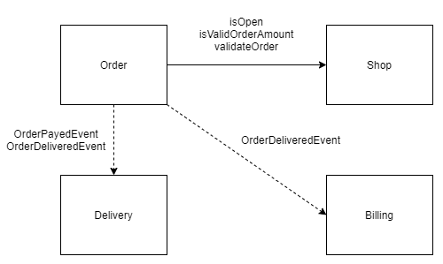

# OOP Practice
> Domain From Woowahan Tech Conference

## Getting Started
```shell script
./gradlew clean
./gradlew assemble
docker-compose up
```

## Using the Application
Use the Swagger UI to invoke the service(CreateOrder/payedOrder/deliveredOrder)
- http://localhost:9000/swagger-ui.html



## Reference
- https://www.youtube.com/watch?v=dJ5C4qRqAgA
- https://github.com/eternity-oop/Woowahan-OO-03-domain-event
- https://javacan.tistory.com/entry/Handle-DomainEvent-with-Spring-ApplicationEventPublisher-EventListener-TransactionalEventListener